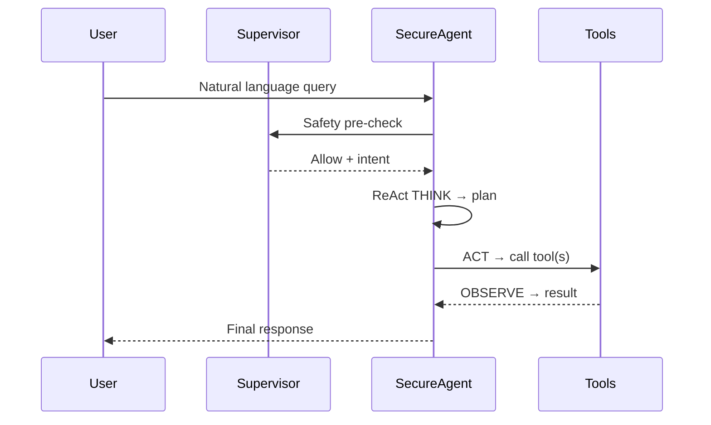

# 🧠 AI File-System Agent – Architecture & Internals

> Consolidated from _DOCS/agent-architecture.md_ and _DOCS/agent-documentation.md_.  
> The file now lives beside the code it describes (`agent/`) for easier maintenance.

---

## 1. Bird’s-Eye View

```
┌──────────────────────────── User Interfaces ───────────────────────────┐
│ CLI Chat • Demo Scripts • (Future) Web UI                              │
└───────────────────────────────────┬────────────────────────────────────┘
                                    ▼
┌──────────────────────────── Security Supervisor ───────────────────────┐
│ Fast safety filter  •  Jailbreak detection  •  Intent extraction       │
└───────────────────────────────────┬────────────────────────────────────┘
                                    ▼
┌──────────────────────────── SecureAgent Core ──────────────────────────┐
│ ReAct reasoning loop • Conversation context • Tool orchestration       │
└───────────────────────────────────┬────────────────────────────────────┘
                                    ▼
┌──────────────────────────── Tool Integration ──────────────────────────┐
│ Workspace-FS (CRUD) • CRUD-Tools (data) • (Future) External APIs       │
└───────────────────────────────────┬────────────────────────────────────┘
                                    ▼
┌──────────────────────────── Infrastructure ────────────────────────────┐
│ Config system • Env loader • Diagnostics & logging • Error hierarchy   │
└────────────────────────────────────────────────────────────────────────┘
```

---

## 2. Core Packages

| Layer / Path                | Key Classes / Scripts                                  | Responsibilities                            |
| --------------------------- | ------------------------------------------------------ | ------------------------------------------- |
| **agent/core/**             | `SecureAgent`, `ReActLoop`, `llm_tool_selector`        | Autonomous reasoning, tool routing, context |
| **agent/supervisor/**       | `SupervisorAgent`                                      | Fast content filter, intent extraction      |
| **tools/workspace_fs/**     | `list_files`, `read_file`, `write_file`, `delete_file` | Sandboxed file ops inside workspace         |
| **tools/crud_tools/**       | Structured data helpers                                | JSON / CSV editing, queries                 |
| **config/**                 | `models.yaml`, `env_loader.py`, `model_config.py`      | Multi-env configuration & model selection   |
| **agent/diagnostics.py**    | `DiagnosticLogger`                                     | Performance, usage, error & health metrics  |
| **agent/diagnostic_cli.py** | `cli` entry-point                                      | Real-time monitoring, log viewer, exports   |

---

## 3. Reasoning Engine – SecureAgent



- **ReAct Phases**

  1. THINK – parse intent, decide next step
  2. ACT – execute a tool or answer
  3. OBSERVE – evaluate outcome, loop until done

- **ConversationContext** stores scratch-pad reasoning and tool traces for transparency.

---

## 4. Safety Gate – SupervisorAgent

| Feature              | Implementation                                                 |
| -------------------- | -------------------------------------------------------------- |
| **Two-phase** filter | cheap Llama-3-8B _first_, fallback to GPT-4o-mini if uncertain |
| Content filters      | NSFW, prompt-injection regexes, path traversal patterns        |
| Intent categories    | list • read • write • delete • search • analyze                |
| Rejection replies    | Polite, with rationale & safer suggestion                      |

---

## 5. Configuration & Environment

- `config/models.yaml` – role→provider:model mapping (dev/test/prod overrides)
- `env_loader.py` – loads `.env.*`, masks keys in diagnostics
- `manage_env.py` – `poetry run python -m config.manage_env setup|validate|list`

---

## 6. Diagnostics & Observability

- **Structured logs** in `logs/` (agent, performance, usage, errors)
- `diagnostic_cli.py performance|usage|health|logs|monitor` for live insights
- `export_diagnostics()` bundles JSON snapshot (stats + recent errors + file sizes)

---

## 7. Error Hierarchy (excerpt)

```python
class AgentError(Exception): ...
class SecurityError(AgentError): ...
class ToolError(AgentError): ...
class ConfigurationError(AgentError): ...

class UnsafeRequestError(SecurityError): ...
class WorkspaceBoundaryError(ToolError): ...
```

---

## 8. Typical Timings _(dev laptop)_

| Operation                    | Avg     |
| ---------------------------- | ------- |
| List files (small workspace) | < 2 s   |
| Read + summarize file        | ~4 s    |
| Multi-step (“largest file…”) | < 10 s  |
| Safety check latency         | ~300 ms |

---

## 9. Future Road-Map

- Web UI via FastAPI+Vue
- Plugin API for 3rd-party tools
- Distributed micro-agents & load-balancer
- Cost-aware dynamic model selection

---

_This document replaces the two separate architecture docs formerly in `DOCS/`._
